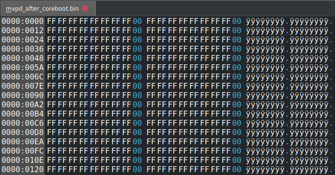
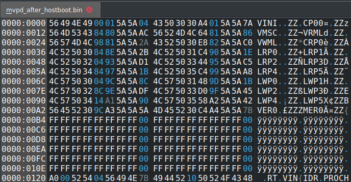

# MVPD data modification

## Test goals

The main goal of this test is to check if `MVPD` partition is modified
before starting hosboot by e.g. `HBBL` or some other part of software
started by `Hostboot`. It is already known that `Hostboot` is not
the one responsible for `MVPD` generation.

## Testing environement

Original `PNOR` image was aquired by building [op-build](https://github.com/3mdeb/openpower-coreboot-docs/blob/main/devnotes/porting.md#building-openpower-firmware).

`MVPD` partition was read using `pflash` tool:
```
pflash -P MVPD -r <output file>
```
## Test results

The file containing `MVPD` partition after running `coreboot` is available
to download [here](https://cloud.3mdeb.com/index.php/s/jk3cDHwE3M7wdKn).


The file containing `MVPD` partition after running `Hostboot` is available
to download [here](https://cloud.3mdeb.com/index.php/s/DKrqonZDtF7pftA).


* After flashing original `PNOR` image, `MVPD` partition
  is empty containg only `ECC`.
* After running `Hostboot` on default `PNOR` image, `MVPD` partition
  is modified.
* After running `Hostboot` for a second time, `MVPD` is not modified anymore and
  equal to image after first `Hostboot` run.
* After running `coreboot` on default `PNOR` image, `MVPD` is not modified
  and is still empty.

## Conclusion

When running `coreboot`, `MVPD` is not modified, therefore it must be filled
after starting `Hostboot`.
