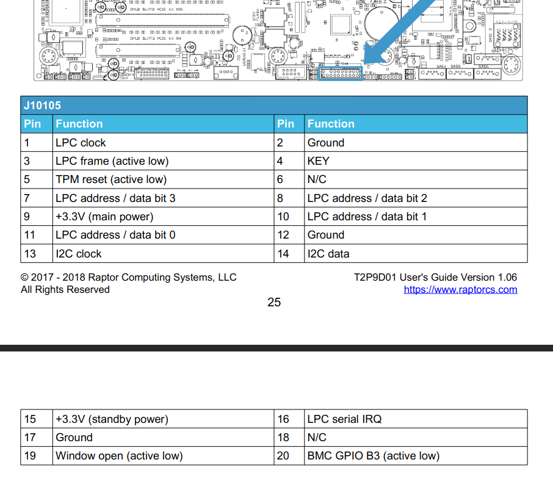

# TPM connection over LPC interface

At this point in time, using TPM module over LPC interface was unsuccessful.

## TPM support in Hostboot

Hostboot mentions in one of the comments in code, that two families of
TPM from Nuvoton vendor are supported.

```
Hostboot code only supports Nuvoton 65x and 75x Models at this time
```

This support was not verified yet.

## Talos II TPM Connector

Talos II TPM connector has `LPC`and `I2C` connections.\
The description is available in the [user guide](https://wiki.raptorcs.com/w/images/e/e3/T2P9D01_users_guide_version_1_0.pdf).


## TPM over LPC interface

`OPTIGA™ TPM SLB 9665TT2.0 TPM2.0` was tested over an LPC interface.

To test the chip, original Hostboot image with [Heads](https://github.com/3mdeb/openpower-coreboot-docs/blob/main/releases/0.3.0.heads.md)
as a payload was flashed into the system.

Talos II properly booted, however no TPM module was detected by Heads.

```
$ dmesg | grep -i tpm
[    4.552516] ima: No TPM chip found, activating TPM-bypass!
```
