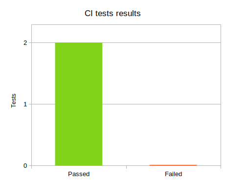
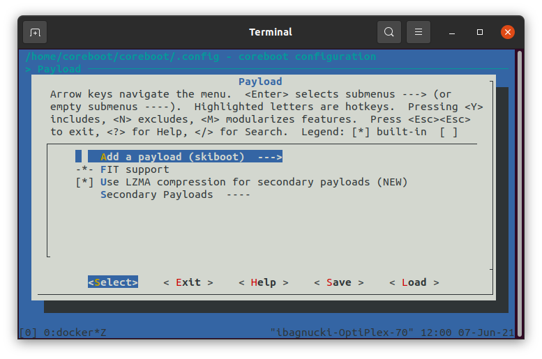

# Dasharo Trustworthy Computing

[https://dasharo.com](https://dasharo.com)

Talos II support in coreboot

## v0.2.0

### Release Changelog
\
**Added:**
* skiboot as a payload option
* Flattened device-tree
* Building of skiboot payload
   * Added [skiboot repository](https://git.raptorcs.com/git/talos-skiboot) to build system
   * Added compilation of flattened device-tree
   * Added merging of device-tree blob and skiboot image into one FIT-image
* Continuous Integration
   * Checking if upstream tests are passed
   * Building Talos II target with bootblock in PNOR
   * Building Talos II target with bootblock in SEEPROM
   * Building FreeBSD tools


**Known issues:**
* Only one CPU core is started

### Download firmware images

#### Release binaries
TBD links

Verifying SHA256 sum

### Release statistics

TBD update after all PR's are done

Since romstage release: \
<span style="color:yellow">12</span> files were changed \
<span style="color:lightgreen">1702</span> lines of code were added \
<span style="color:orangered">3</span> lines of code were removed

### Testing

\
[Test results source](https://github.com/3mdeb/coreboot/pull/65/checks)

### Hardware configuration

Configuration with a single IBM POWER9 64bit CPU is supported.\
Dual CPU setup not supported currently.

Following RAM configurations were tested and are proved to be properly initialized.
<pre>
MCS0, MCA0
   DIMM0: <a href=https://www.samsung.com/semiconductor/dram/module/M393A2K40CB2-CTD>1Rx4 16GB PC4-2666V-RC2-12-PA0</a>
   DIMM1: not installed
MCS0, MCA1
   DIMM0: <a href=https://www.crucial.com/memory/server-ddr4/mta9asf1g72pz-2g6j1>1Rx8 8GB PC4-2666V-RD1-12</a>
   DIMM1: not installed
MCS1, MCA0
   DIMM0: <a href=https://www.samsung.com/semiconductor/dram/module/M393A4K40CB2-CTD>2Rx4 32GB PC4-2666V-RB2-12-MA0</a>
   DIMM1: not installed
MCS1, MCA1
   DIMM0: <a href=https://mis-prod-koce-homepage-cdn-01-blob-ep.azureedge.net/web/static_file/12701730956286135.pdf>2Rx8 16GB PC4-2666V-RE2-12</a>
   DIMM1: not installed
</pre>

All 3 major DRAM vendors are supported, namely Samsung, Micron and Hynix.

### Building binary using source code:

#### Environment preparation

In order to build coreboot, we use docker container. So in order to setup
environment, ensure that:

1. You have docker installed as described on
   [docker site](https://docs.docker.com/engine/install/) for your Linux distro.

2. When you have the docker installed pull the container:

   ```
   docker pull docker.pkg.github.com/3mdeb/coreboot/coreboot-sdk
   ```

In order to start from a common point, flash the original OpenPOWER firmware
for Talos II.

1. Log into the BMC via SSH:

   ```
   ssh root@<BMC_IP>
   ```

2. Download the stock firmware image:

   ```
   wget https://cloud.3mdeb.com/index.php/s/canxPx5d4X8c2wk/download -O /tmp/flash.pnor
   ```

3. Flash the firmware:

   ```
   pflash -E -p /tmp/flash.pnor
   ```

   > You will see warning like `About to erase chip !` and
   > `WARNING ! This will modify your HOST flash chip content !`. When the
   > `Enter "yes" to confirm:` prompt appears, type `yes` and press enter.

   At the end of the process (it may take several minutes) you should have
   something like this:

   ```
   About to program "/tmp/flash.pnor" at 0x00000000..0x04000000 !
   Programming & Verifying...
   [==================================================] 100% ETA:0s
   ```

4. * Log into the BMC GUI at https://<BMC_IP>/. \
     Make sure to use `https`.
   * Enter the Server power operations
     `https://<BMC_IP>/#/server-control/power-operations` and invoke
     warm reboot.
   * Then move to Serial over LAN remote console
     `https://<BMC_IP>/#/server-control/remote-console` to observe
     whether the platform is booting.

#### Buidling coreboot image

In order to build coreboot image, follow the steps below:

1. Clone the coreboot repository:

   ```
   git clone git@github.com:3mdeb/coreboot.git -b TBD_TAG_NAME
   # or HTTPS alternatively
   git clone https://github.com/3mdeb/coreboot.git -b TBD_TAG_NAME
   ```
   `talos_2_support_ramstage` - ramstage devlopment branch - merge requests should go here.\
   `squashed_talos_2_support` - upstream branch, can be regularly pushed with force.\
   `talos_2_support` - legacy branch for bootblock and romstage release - as of today nothing should be pushed here.

2. Get the submodules:

   ```
   cd coreboot
   git submodule update --init --checkout
   ```

3. Start docker container (assuming you are already in coreboot root
   directory):

   ```
   docker run --rm -it -v $PWD:/home/coreboot/coreboot -w /home/coreboot/coreboot docker.pkg.github.com/3mdeb/coreboot/coreboot-sdk /bin/bash
   ```

4. When inside of the container, configure the build for Talos II:

   ```
   make menuconfig
   ```

   * Navigate to the **Mainboard** submenu.
   * As a **Mainboard vendor** select `Raptor Computing Systems`.
   * Select Exit and then navigate to the **Payload** submenu.
   * In **Add a payload** select `skiboot`.
   * Save the configuration and exit.

   
   


5. Start the build process of coreboot inside the container:

   ```
   make
   ```

#### Running the coreboot on Talos II

1. At the end of build process you should see `Built raptor-cs/talos-2 (Talos II)`.
   Copy the result binary from `<coreboot_dir>/build/coreboot.rom.signed.ecc` to the BMC
   (assuming in the coreboot root directory):

   ```
   scp build/bootblock.signed.ecc root@192.168.20.9:/tmp/bootblock.signed.ecc
   scp build/coreboot.rom.signed.ecc root@192.168.20.9:/tmp/coreboot.rom.signed.ecc
   ```

2. Backup the HBB partition (for faster later recovery) by invoking this
   command on BMC:

   ```
   pflash -P HBB -r /tmp/hbb.bin
   ```

3. Flash the binary by replacing HBB partition (execute from BMC):

   ```
   pflash -e -P HBB -p /tmp/bootblock.signed.ecc
   pflash -e -P HBI -p /tmp/coreboot.rom.signed.ecc
   ```

   Answer yes to the prompt and wait for the process to finish.

4. Log into the BMC GUI again at https://<BMC_IP>/.\
   Enter the Server power operations (https://<BMC_IP>/#/server-control/power-operations) and invoke warm reboot.\
   Then move to Serial over LAN remote console (https://<BMC_IP>/#/server-control/remote-console)\
   Wait for a while until coreboot shows up:

   TBD asciicast

5. Enjoy the coreboot running on Talos II.

> **Optional:** In order to recovery the platform quickly to healthy state, flash
> the HBB partition back with: \
> `pflash -e -P HBB -p /tmp/hbb.bin`
